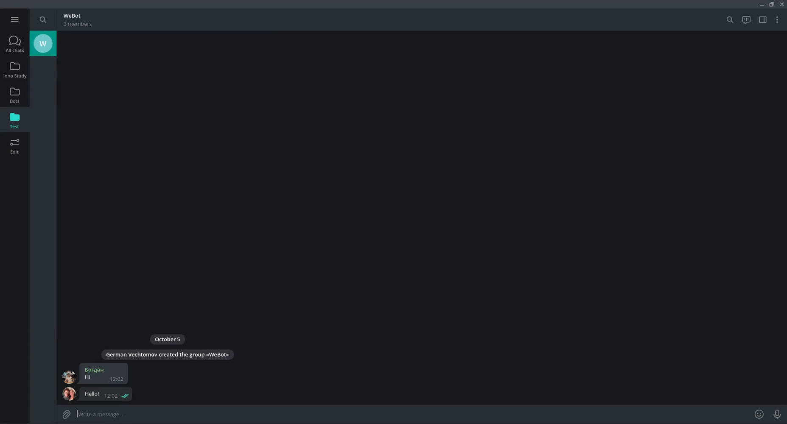

# WeBot

This is a Telegram bot that helps you to publish your chats in the web.
Many Telegram chats can be of great benefit to people.
Therefore, many people want to export chats, and publish them - so that people can read and share knowledge in this way.
Even more if the URLs are indexed by search engines - it can be a good knowledge source.
For this we need a convenient tool that will not need additional actions on the part of the user.



## Table of content

- 1. [Table of content](#table-of-content)
- 2. [Installation and run](#installation-and-run)
- 3. [Development plan](#development-plan)
  - 3.1. [Technical Stack](#technical-stack)
  - 3.2. [Prototype Screenshots](#prototype-screenshots)
  - 3.3. [Requirement Analysis and Specifications](#requirement-analysis-and-specifications)
    - 3.3.1. [Features](#features)
    - 3.3.2. [User Stories](#user-stories)
  - 3.4. [Business Goals and Objectives](#business-goals-and-objectives)
  - 3.5. [Roles and responsibilities](#roles-and-responsibilities)
  - 3.6. [Project Glossary](#project-glossary)
  - 3.7. [Quality Attributes](#quality-attributes)
  - 3.8. [Constraints](#constraints)
  - 3.9. [Architecture](#architecture)
    - 3.9.1. [UML use case diagram](#uml-use-case-diagram)
    - 3.9.2. [Class diagram](#class-diagram)
    - 3.9.3. [Static view](#static-view)
    - 3.9.4. [Dynamic view](#dynamic-view)
    - 3.9.5. [Allocation view](#allocation-view)
    - 3.9.6. [Sequence 1](#sequence-1)
    - 3.9.7. [Sequence 2](#sequence-2)
  - 3.10. [Code style](#code-style)
  - 3.11. [Tests](#tests)
  - 3.12. [Software Development Plan](#software-development-plan)
- 4. [Authors](#authors)

## Installation and run

To run, pull this repository and create two `.env` files in `api/` and `bot/` directory:

```bash
api/.env
AWS_ACCESS_KEY_ID=<>
AWS_SECRET_ACCESS_KEY=<>
REGION_NAME=<>
QUEUE_NAME_IN=<>
QUEUE_NAME_OUT=<>
MONGODB_URL=<>
```

```bash
bot/.env
AWS_ACCESS_KEY_ID=<>
AWS_SECRET_ACCESS_KEY=<>
REGION_NAME=<>
API_ID=<>
API_HASH=<>
```

Then you can build Docker Images:

```bash
docker-compose build
```

And finally start instances (by default backend listen on port `51212`, but you have access to `docker-compose.yml` file):

```bash
docker-compose up -d
```

## Development plan

### Technical Stack

- [Azure](https://azure.microsoft.com/) hosting server
- [AWS SQS](https://aws.amazon.com/ru/sqs/) queue service
- [Python](https://www.python.org/) programming language
- [Flask](https://flask.palletsprojects.com/en/2.0.x/) web framework
- [Docker](https://docs.docker.com/desktop/) container runtime
- [Docker-Compose](https://docs.docker.com/compose/) container orchestrator
- [Pytest](https://pytest.org/) testing library
- [MongoDB](https://www.mongodb.com/) database
- [Bootstrap](https://getbootstrap.com/) css framework
- [JavaScript](https://developer.mozilla.org/en-US/docs/Web/JavaScript) programming language
- [Telegram](https://telegram.org/) messaging platform for bot
- [SonarQube](https://www.sonarqube.org/) code style and errors checker
- [Flake8](https://gitlab.com/pycqa/flake8) code style and errors checker (with github actions integration)

### Prototype Screenshots


### Requirement Analysis and Specifications

#### Features

| ID  | User Story Title  | Priority |
| --- | ----------------- | -------- |
| 1   | Chat publication  | Must     |
| 2   | Web chat reading  | Must     |
| 3   | Access control    | Normal   |
| 4   | Admin rights      | Normal   |
| 5   | Chat updates      | Low      |
| 6   | Media processing  | Low      |
| 7   | Publishing rights | Low      |

#### User Stories

| Status   | User Type  | User Story Title | User Stories                                                                |
| -------- | ---------- | ---------------- | --------------------------------------------------------------------------- |
| **Done** | Chat Admin | Chat publication | As a chat admin I want to publish my chat in the internet with telegram bot |
| **Done** |            | Access control   | As a chat admin I want to be the only want who can publish the chat         |
| **Done** |            | Admin rights     | As a chat admin I want to be able to revoke access to chat in web           |
| **Done** | Chat User  | Chat updates     | As a user I want the chat to update automatically                           |
| **Done** |            | Web chat reading | As a user I want to read chat messages from published chat in web browser   |

### Business Goals and Objectives

- We will make paid software without ads.
- We plan to make this app available with paid subscriptions.
- We plan to make this app widely used around the world (with help of ads).
- We will make deploying infrastructure as simple as possible.
- We plan to expand the capabilities of the application over time.

### Roles and responsibilities

| Stakeholder's Name | Roles             | Responsibilities                        |
| ------------------ | ----------------- | --------------------------------------- |
| Developer          | Backend engineer  | Telegram bot development                |
|                    | Backend engineer  | Backend development                     |
|                    | DevOps engineer   | Deployment                              |
|                    | Frontend engineer | Frontend development                    |
|                    | QA                | Requirement analysis                    |
| Manager            | Product manager   | Create plan                             |
|                    | Product owner     | Determine user stories                  |
|                    | Product owner     | Determine business goals and objectives |

### Project Glossary

- Backend - Part of code that is not visible to end user
- Frontend - Part of code with which end user directly interacts
- Unit test - a piece of code that checks whether another piece of code works as expected
- Admin - a user that has “admin” role in telegram chat
- DevOps - assistance in integrating development and operation
- QA - quality assurance of code and infrastructure
- Chat update - receiving a new message and adding it to the database
- Bot - an automated tool that is added to the telegram chat and publishes a link to the web interface with messages from the chat

### Quality Attributes

| Characteristics        | Sub-Characteristics Definition | How we will achieve it                                                                                                                  |
| ---------------------- | ------------------------------ | --------------------------------------------------------------------------------------------------------------------------------------- |
| Usability              | User interface aesthetics      | Client will use Telegram app user interface to communicate with our bot                                                                 |
| Reliability            | Recoverability                 | Bot should be able to recover in case of crash or failure automatically (docker-compose restart:always)                                 |
| Reliability            | Fault tolerance                | At least some nodes of bot should be available at any time (replication) (Azure servers)                                                |
| Security               | Confidentiality                | The published chat history is available for viewing by users who followed the link                                                      |
| Performance Efficiency | Time-behavior                  | Maximum load time should not be bigger than 5 s. To achieve this we need to test load speeds of the app and optimize the code if needed |

### Constraints

- Do not store more than 5000 messages per chat
- The bot should not read chats for which it does not have permission
- The bot should not publish chats unless an admin asked him to do it
- The bot should not publish chats if admin haven’t paid for the subscription

### Architecture

On [this](https://miro.com/app/board/o9J_lzxVDsw=) link you can find:

#### UML use case diagram


#### Class diagram


#### Static view


#### Dynamic view


#### Allocation view


#### Sequence 1


#### Sequence 2


### Code style

We have automatic error and code style checker `flake8`.
And integration tests performed locally (with `AWS` and `Telegram API` credentials) with `pytest`.

Code style checked by `flake8`:


Test performed on server with correct `.env` file by `pytest`:


### Tests

After reading the post [The TDD That Works for Me](https://www.yegor256.com/2017/03/24/tdd-that-works.html) we believe that we do not need to write the test unless something is broken and reported. So far we haven't found anything that breaks our app so we haven't wrote the tests.

### Software Development Plan

| Status   | **Inception Phase**    |                         |                    |                                                                                                                                   |                                                                                                               |
| -------- | ---------------------- | ----------------------- | ------------------ | --------------------------------------------------------------------------------------------------------------------------------- | ------------------------------------------------------------------------------------------------------------- |
|          | # Iteration            | Timeline                | Stakeholder        | Activities                                                                                                                        | Artifacts                                                                                                     |
| **Done** | 1                      | 25/08/2021 - 26/08/2021 | Manager            | Determine Business goals and objectives with valid justification, Identify the stakeholders, Establish roles and responsibilities | Deliver the documentation of achieved milestones                                                              |
| **Done** | 2                      | 25/08/2021 - 26/08/2021 | Developer          | Requirement engineering (20% user stories)                                                                                        | Update the documentation of achieved milestones with User stories                                             |
|          | **Elaboration Phase**  |                         |                    |                                                                                                                                   |                                                                                                               |
|          | # Iteration            | Timeline                | Stakeholder        | Activities                                                                                                                        | Artifacts                                                                                                     |
| **Done** | 1                      | 25/08/2021 - 26/08/2021 | Manager            | Revise User Stories (100%)                                                                                                        | Document 100% user stories                                                                                    |
| **Done** | 2                      | 25/08/2021 - 26/08/2021 | Developer, Manager | Software development planning                                                                                                     | Iteration Plan                                                                                                |
| **Done** | 3                      | 25/08/2021 - 26/08/2021 | Developer          | Software Architecture, Test Plan                                                                                                  | Software architecture document, Test Plan Document                                                            |
| **Done** | 4                      | 25/08/2021 - 26/08/2021 | Developer, Manager | Transition plan                                                                                                                   | Transition plan document                                                                                      |
|          | **Construction Phase** |                         |                    |                                                                                                                                   |                                                                                                               |
|          | # Iteration            | Timeline                | Stakeholder        | Activities                                                                                                                        | Artifacts                                                                                                     |
| **Done** | 1                      | 30/08/2021 - 12/09/2021 | Developer          | Implement Chat publication, Unit test cases                                                                                       | Telegram chat bot, Unit test results                                                                          |
| **Done** | 1                      | 30/08/2021 - 12/09/2021 | Developer          | Implement Web chat reading, Unit test cases                                                                                       | Simple web page with text messages from the chat, Unit test results for backend                               |
| **Done** | 1                      | 30/08/2021 - 12/09/2021 | Developer          | Implement Access control, Unit test cases                                                                                         | Working feature 1 branch, Unit test results                                                                   |
| **Done** | 2                      | 13/09/2021 - 26/09/2021 | Developer          | Implement Admin rights, Unit test cases                                                                                           | Error page, Unit test results                                                                                 |
| **Done** | 2                      | 13/09/2021 - 26/09/2021 | Developer          | Implement Chat updates, Unit test cases                                                                                           | Refreshable page, Unit test results                                                                           |
|          | **Transition Phase**   |                         |                    |                                                                                                                                   |                                                                                                               |
|          | # Iteration            | Timeline                | Stakeholder        | Activities                                                                                                                        | Artifacts                                                                                                     |
| `TODO`   | 1                      | 25/09/2021 - 06/10/2021 | Developer          | Integration, end to end testing, training for Users and Developers                                                                | Github repository, merged branches, integration and ended to end test results, final README, deployed product |
| **Done** | 2                      | 01/10/2021 - 06/10/2021 | Developer, Manager | Final product release                                                                                                             | Working Product                                                                                               |

### Milestones

| Milestone | Timeline                | Status   |
| --------- | ----------------------- | -------- |
| Alpha     | 31/08/2021 - 06/09/2021 | **Done** |
| Beta      | 18/09/2021 - 25/09/2021 | **Done** |
| Gamma     | 04/10/2021 - 09/10/2021 | **Done** |

## Authors

- German Vechtomov
- Alexey Posikera
- Bogdan Kondratev
- Dmitrii Chermnykh
